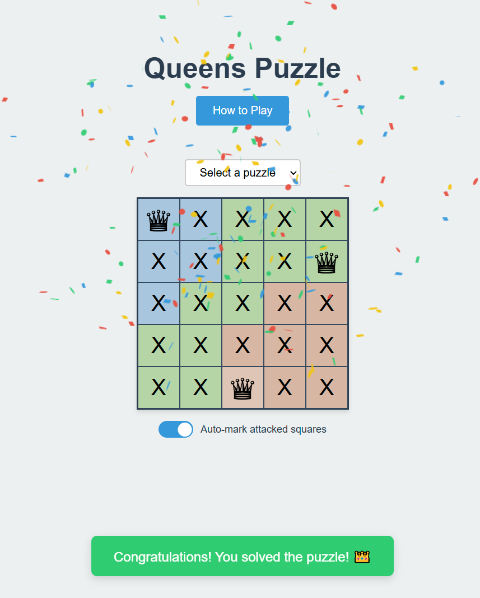

# Queens Game

A puzzle game where you need to place queens on a 5x5 board following specific rules. The goal is to place exactly one queen in each colored region while ensuring no queen can attack another queen.

## Game Rules

1. The board is divided into 3 colored regions
2. You must place exactly one queen in each colored region
3. Queens cannot attack each other:
   - No two queens can be in the same row
   - No two queens can be in the same column
   - No two queens can be on the same diagonal
   - No two queens can be in the same colored region

## Controls

- **Left Click**: Toggle X markers
  - Place an X on squares attacked by queens
  - Remove an X marker you previously placed
- **Right Click**: Place/Remove queens
  - Place a queen on an empty square
  - Remove an existing queen
  - Cannot place queens on squares marked with X (attacked squares)

## Features

- **Auto-X Mode**: Automatically marks all squares that are attacked by placed queens
- **Visual Feedback**: 
  - Invalid placements show error messages
  - Winning condition triggers a celebration animation
- **Interactive Tutorial**: Helps players learn the game mechanics

## Technical Implementation

The game is implemented in TypeScript with a focus on clean, maintainable code. Key components:

### Board Class
- Manages the 5x5 game board state
- Handles player interactions (left/right clicks)
- Validates queen placements
- Tracks attacked squares
- Checks win conditions

### State Management
- Board state tracks position of queens and X markers
- Color regions are defined in a 2D array
- Auto-X mode can be toggled to help visualize attacked squares

## Development

### Prerequisites
- Node.js
- pnpm (Package manager)

### Setup
1. Install dependencies: `pnpm install`
2. Run development server: `pnpm dev`
3. Run tests: `pnpm test`

## Implementation Notes

The game uses several design patterns and techniques:
- **Event Delegation**: Efficient event handling for board interactions
- **State Management**: Clear separation of board state and UI
- **Validation**: Comprehensive rule checking for queen placement
- **Visual Feedback**: Immediate feedback for player actions
- **Automated Testing**: Unit tests for game logic

